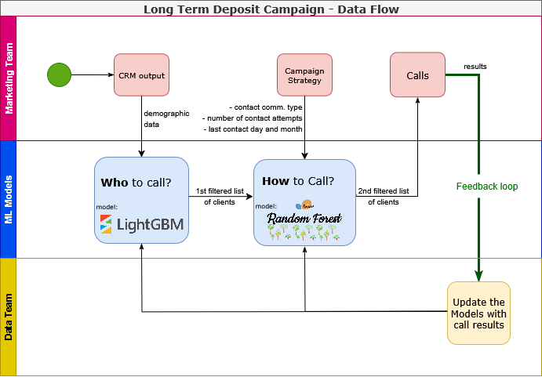
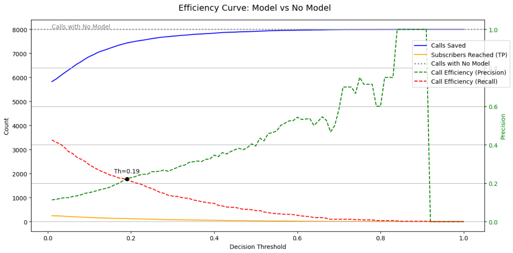
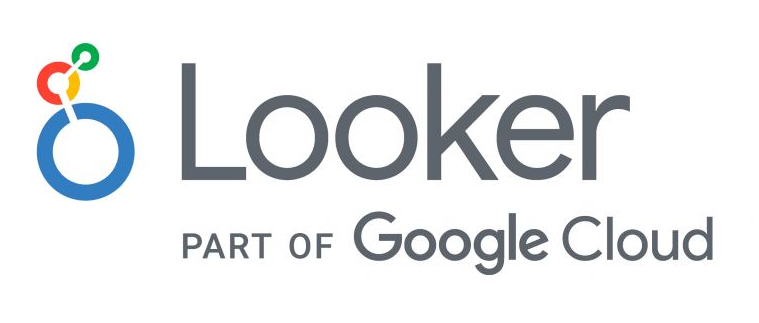

# Term Deposit Marketing using a Machine Learning approach

---

<table>
  <tr>
    <td style="vertical-align: top; padding-right: 20px; line-height: 1.6; font-size: 16px;">

<b>The goal of this project</b> was to improve and bring efficiency to a European bank's marketing campaign through Machine Learning.  
The work was divided into two parts: first, developing a model to effectively identify potential term deposit subscribers; and second, analyzing subscriber segmentation to guide future marketing actions.

This study showcases:
- Data preprocessing  
- Feature engineering  
- Predictive modeling  
- Client segmentation for business-oriented communication of insights  

<br>

<b>This project was completed as part of Apziva.</b>

</td>
    <td style="text-align: center;">
      
    </td>
  </tr>
</table>

---

## Project Overview

This real-world project analyzes a direct marketing campaign conducted by a European bank to promote term deposit subscriptions. The core objective is twofold:

1. **Predict** whether a customer will subscribe to a term deposit.  
2. **Profile** subscriber segments using clustering to support targeted marketing strategies.

Through this project, I demonstrate end-to-end skills in data preparation, modeling, and unsupervised segmentation using tools like Scikit-learn, LightGBM, LazyPredict, Pandas, DuckDB, Google Looker Studio, and Streamlit.

---

## ML Workflow Diagram

The following chart illustrates the end-to-end data flow that we designed for the Term Deposit Campaign:




- The **Marketing Team** provides CRM output and campaign strategy parameters.  
- The **ML Models** filter and score leads based on historical data using LightGBM and Random Forest models.  
- The **Data Team** ensures a feedback loop by updating the models based on call outcomes.

---

## Project Workflow

### Part 1 – Predictive Modeling

**Goal:** Predict and filter the customers likely to subscribe to a term deposit product (classification).

#### Steps:
1. **Data Understanding & Cleaning**
   - Loaded the marketing dataset.  
   - Explored and understood each feature; compared distributions and histograms for subscribers and non-subscribers.  
   - Recorded insights and initial conclusions from the Exploratory Data Analysis.

   **Feature Engineering**
   - Encoded and filtered features.  
   - Transformed categorical and ordinal features.  
   - Scaled numerical values to improve model performance.  
   - Defined the sampling strategy (over + under sampling).

2. **Business Modeling**
   - Designed the 2-step model pipeline.  
   - Selected the input features for each step.  
   - Evaluated multiple classifiers: Logistic Regression, Random Forest, XGBoost, LightGBM, and others.  
   - Applied 5-fold cross-validation.  
   - Compared cross-validation with test set performance for variance analysis.  
   - Achieved over **81% accuracy** using the optimized pipeline.

3. **Campaign Simulation**
   - Reproduced the client lists.  
   - Evaluated the combined model efficiency based on the decision threshold.  
   - Answered key business questions:  
     + How many calls are we saving?  
     + How much time are we saving?

#### ML solution efficiency chart




By combining two models in sequence, the first focused on maximizing recall (capturing all potential subscribers), and the second tuned for precision (prioritizing call efficiency), we optimized campaign effectiveness.
This strategy resulted in saving over 7,000 out of 8,000 calls while maintaining strong subscriber reach, as seen at decision threshold ≈ 0.19.
The efficiency curve below shows how the dual-model pipeline drastically reduces effort compared to calling all clients without a model.
 
#### Notebook

Explore the full implementation and experiment details in the notebook:

[TermDepositMarketing_part1.ipynb](TermDepositMarketing_part1.ipynb)


---

### Part 2 – Unsupervised Client Segmentation

**Goal:** Identify actionable customer profiles using clustering on subscribers only.

#### Steps:
1. **Filtered the dataset** to include only `y=1` (subscribed customers).  
2. **Applied K-Means clustering** to create customer segments.  
3. **Analyzed each cluster's profile**:
   - Demographics (age, education, marital status)  
   - Financial status (balance, loan, housing)  
   - Campaign characteristics (contact month, campaign frequency)  
4. **Visualized clusters** using PCA, t-SNE, and UMAP.  
5. **Enabled business interpretation**:
   - E.g., “Students and retirees form strong segments that persist across different clustering configurations.”

#### Notebook

Explore the full implementation and experiment details in the notebook:

[TermDepositMarketing_part2.ipynb](TermDepositMarketing_part2.ipynb)

---

#### Environment & Requirements

To reproduce the experiments, I recommend installing the required dependencies for each notebook separately.

As an example, you can find the dependencies for Part 1 in:

[`requirements_part1.txt`](requirements_part1.txt)

You can install them via:

```bash
pip install -r requirements_part1.txt 
``` 

---

## Tools & Technologies

| Category          | Tools Used                                                        |
|-------------------|--------------------------------------------------------------------|
| Data Manipulation | `pandas`, `numpy`, `DuckDB`                                        |
| Machine Learning  | `scikit-learn`, `imblearn`, `LazyPredict`, `LightGBM`, `XGBClassifier`, `KMeans` |
| Visualization     | `matplotlib`, `seaborn`, `PCA`                                     |
| Deployment        | `Streamlit` (interactive dashboard)                                |
| Evaluation        | Cross-validation, Confusion Matrix, ROC AUC                        |

---

<h2 style="display: flex; justify-content: space-between; align-items: left;">
  Google Looker Studio Dashboard
  
</h2>

## Google Looker Studio Dashboard

An interactive dashboard was created to explore:
- Cluster profiles (k=5)  
- Including: balance account, age, education, job and marital distribution, loan, housing, and default conditions.

---

## 📁 Repository Structure

```
Term_Deposit_Marketing/
├── dashboard/                        # dashboard gen files and data
├── data/                             # main dataset
├── README.md                         # This file
├── TermDepositMarketing_part1.ipynb  # Part1 notebook
├── TermDepositMarketing_part2.ipynb  # Part2 notebook
├── requirements_part1.txt            # Part1 dependencies
└── requirements_part2.txt            # Part2 dependencies

```

---

## Business Impact

- The model helps the bank **prioritize whom to call**, reducing costs and increasing subscriptions per call and calling time.  
- The segmentation enables **targeted campaigns**, e.g., sending different offers to retirees vs. regular customers.  
- DuckDB enabled fast, SQL-powered in-memory analytics for efficient exploration, laying the groundwork for future deployment.

---

## This project showcases:

- **End-to-end machine learning capabilities**, from raw data to actionable insights.  
- Proficiency with **Python and ML tools**, combined with visual storytelling.  
- The ability to connect **technical outcomes to business value**.

Interested in the project details? Want to implement something similar for your company?

I'm ready to help. Please contact me at:

🔗 [My LinkedIn Profile](https://www.linkedin.com/in/federico-bessi/)  
📫 Reach me at **federico.bessi@gmail.com**

---

